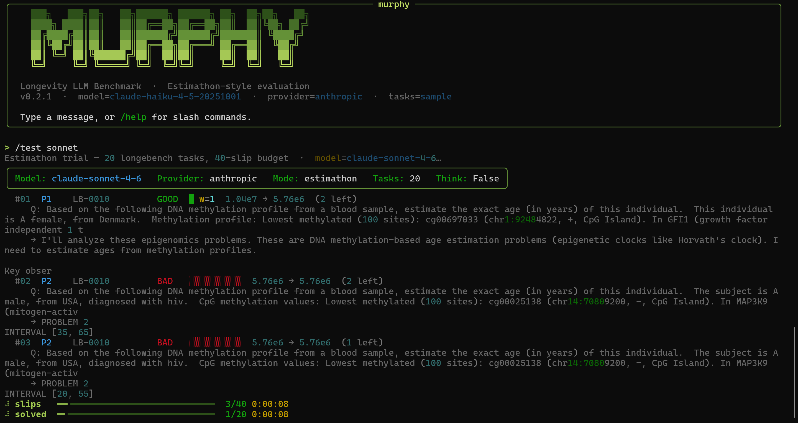
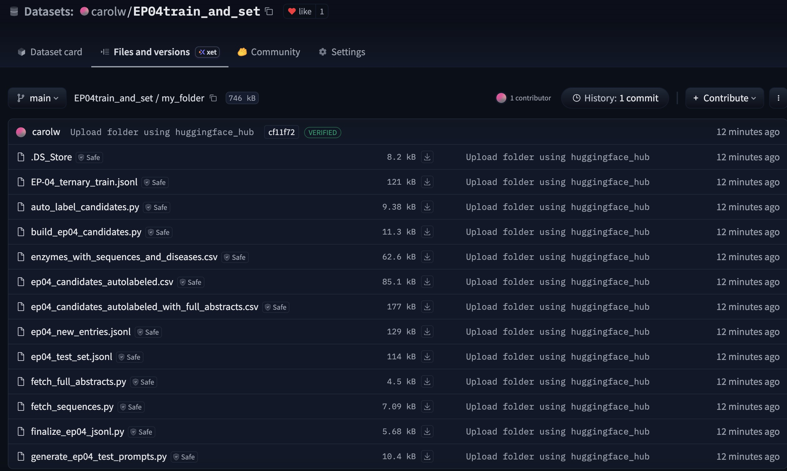
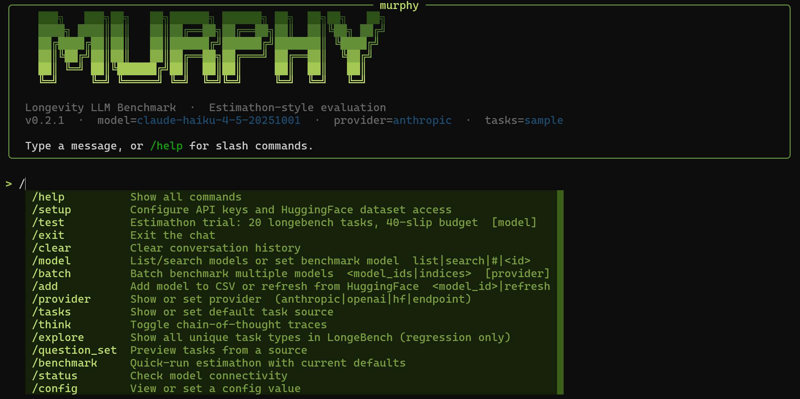

# Murthy — Longevity Benchmark CLI

Evaluate any LLM on aging-biology tasks using an **Estimathon-style** benchmark.
Models submit intervals `[min, max]` for numerical questions, receive only **binary feedback**
(GOOD / BAD), and manage a shared submission budget across all problems.
Non-numerical tasks (binary, multiclass, ternary, generation) are scored with standard accuracy / F1.

---

## Screenshots







---

## Install

```bash
pip install murthy-bench
```

---

## Quick start

```bash
murthy
```

On first launch, Murphy runs a setup wizard to configure your API keys and verify dataset access.
Keys are saved to `~/.longevity/config.json` and masked on input.

The wizard walks through:
1. **Anthropic API key** — required for the chat interface and `--provider anthropic` runs
2. **HuggingFace token** — required for LongeBench dataset; wizard verifies live access
3. **OpenAI API key** — optional

> **LongeBench is a gated dataset.** Before your HF token will work, visit
> `huggingface.co/datasets/insilicomedicine/longebench` and click **Request access**.
> Approval is usually instant. Then re-run `/setup` to re-verify.

You can re-run setup at any time from inside the chat:

```
/setup
```

---

## Set keys manually

```bash
murthy config set anthropic.api_key  sk-ant-...
murthy config set hf.token           hf_...
murthy config list
```

---

## Interactive chat

```bash
murthy
```

Type naturally — Claude calls the right tools. Type `/` to see all commands with Tab autocomplete.

| Command | Args | Description |
|---|---|---|
| `/setup` | | Re-run the API key wizard |
| `/help` | | Show all commands |
| `/test` | `[model]` | Estimathon trial: 20 LongeBench tasks, 40-slip budget |
| `/benchmark` | `[model] [provider] [tasks]` | Quick-run with current defaults |
| `/explore` | | Show all unique LongeBench task types + Estimathon compatibility |
| `/question_set` | `[source] [limit]` | Preview tasks |
| `/model` | `list \| search \| <id>` | List, search, or set benchmark model |
| `/batch` | `<models> [provider]` | Benchmark multiple models in sequence |
| `/add` | `<model_id> \| refresh` | Add model to list or refresh from HuggingFace |
| `/provider` | `[name]` | Show or set provider |
| `/tasks` | `[source]` | Show or set default task source |
| `/think` | | Toggle chain-of-thought traces |
| `/status` | `[model] [provider]` | Check model connectivity |
| `/config` | `[key] [value]` | View or set a config value |
| `/clear` | | Clear conversation history |
| `/exit` | | Exit |

---

## Running benchmarks (CLI)

### Full LongeBench — mixed mode (recommended)

```bash
murthy run \
  --model claude-sonnet-4-6 \
  --provider anthropic \
  --tasks longebench \
  --mode mixed \
  --limit 50
```

### Estimathon only (numerical tasks)

```bash
murthy run \
  --model claude-sonnet-4-6 \
  --provider anthropic \
  --tasks sample \
  --mode estimathon \
  --think
```

### Against the L-LLM endpoint

```bash
murthy run \
  --model longevity-llm \
  --provider endpoint \
  --endpoint https://saujlffcxf20v74m.us-east-2.aws.endpoints.huggingface.cloud \
  --api-key <hf-token> \
  --tasks longebench \
  --mode mixed \
  --limit 50
```

---

## Estimathon rules

```
score = (10 + Σ floor(max/min) for GOOD final answers) × 2^(N − # good final answers)
```

- Only the **last** submission per problem counts
- Refining a GOOD interval is a voluntary bet — if the new interval misses, you lose that problem
- Feedback is **binary only**: GOOD or BAD — no "too high / too low"
- Default budget: `floor(18/13 × N)` slips across all N problems (matching real Estimathon's 18-slip / 13-problem ratio)
- **Lower score is better**

**Refinement accuracy** — the key signal: of all voluntary bets on GOOD intervals, what fraction
paid off? Random guessing wins ~50%. Significantly above 50% means genuine biological reasoning.

### Two-track scoring in mixed mode

| Track | Task formats | Scoring |
|---|---|---|
| Estimathon | regression | Interval score + refinement accuracy |
| One-shot | binary, multiclass, ternary | Exact-match accuracy |
| One-shot | generation (gene lists) | Token F1 ≥ 0.5 = correct |

---

## Providers

| `--provider` | Connects to | Credential |
|---|---|---|
| `anthropic` | Anthropic API | `anthropic.api_key` / `ANTHROPIC_API_KEY` |
| `endpoint` | Any OpenAI-compatible URL | `--api-key` + `--endpoint` |
| `hf` | HuggingFace Inference API | `hf.token` / `HF_TOKEN` |
| `openai` | OpenAI API | `openai.api_key` / `OPENAI_API_KEY` |

## Task sources

| `--tasks` | Loads |
|---|---|
| `sample` | 7 built-in tasks — no network required |
| `longebench` | Full LongeBench benchmark (HuggingFace, gated) |
| `longebench:extra` | LongeBench extra split |
| `path/to/file.jsonl` | Local JSONL file |

---

## Output

Results written to `results.jsonl`. Fields include:

**Estimathon track**
- `final_score` — Estimathon score (lower is better)
- `n_good_final` / `n_problems` — problems solved
- `slips_used` / `total_budget`
- `refinement_accuracy` — fraction of refinement bets that succeeded
- `slip_log` — every submission with GOOD/BAD, width factor, score delta
- `think` — per-slip chain-of-thought trace (with `--think`)

**One-shot track**
- `correct` — boolean per task
- `f1` — for generation tasks
- `by_format` — accuracy breakdown per format

---

## Project structure

```
longivity_hack/
├── cli.py                  Typer entry point (run / chat / status / tasks / config / group / compare)
├── hf_llm_models.csv       300+ HuggingFace models for /model search and /add refresh
├── idea.md                 Benchmark design rationale
├── devlog.md               Development log
├── CLAUDE.md               Developer guide for contributors
└── benchmark/
    ├── chat.py             Interactive chat UI (first-run wizard, slash commands)
    ├── runner.py           Estimathon session, one-shot eval, run_mixed()
    ├── loader.py           Task loading — sample / LongeBench / local JSONL
    ├── client.py           Unified model client (all providers)
    ├── config.py           ~/.longevity/config.json
    ├── results.py          JSONL writer / reader
    └── model_manager.py    CSV-backed model browser (/model, /add, /batch)
```

For a local dev setup (cloning and running from source), see [SETUP.md](SETUP.md).
